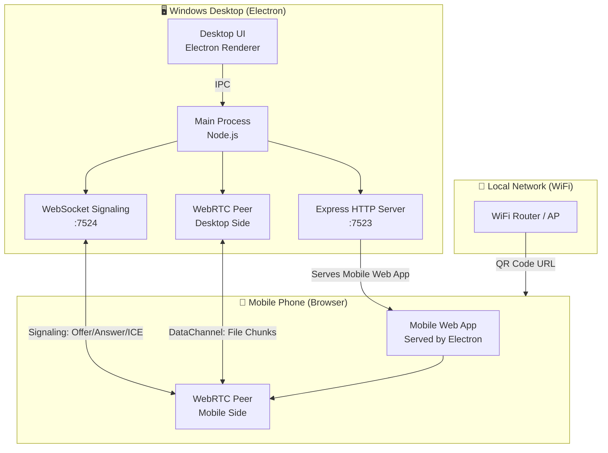
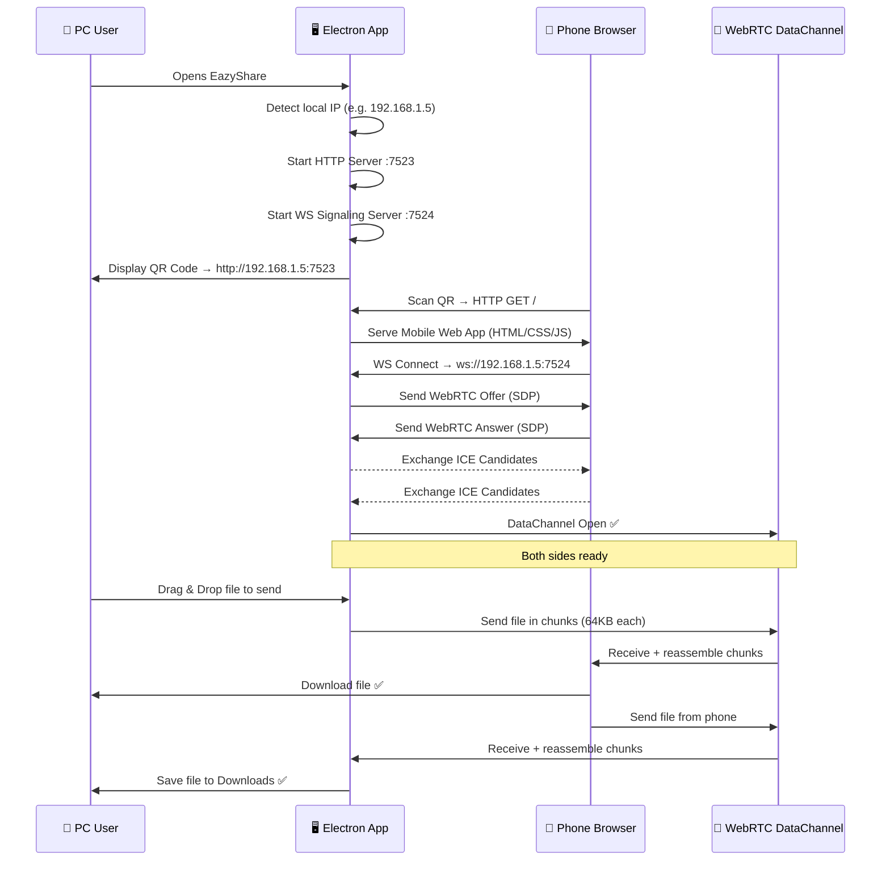

# EazyShare — Windows LAN File Sharing App
### Built with Electron + WebRTC + Local Web Server

---

## 🧠 Concept Summary

A Windows desktop app that:
- Hosts a **local HTTP + WebSocket server** on your LAN
- Generates a **QR code** pointing to that server
- Phone scans the QR → opens a **browser-based mobile UI**
- Files transfer **peer-to-peer via WebRTC DataChannel**
- Supports **bidirectional transfer** (PC → Phone and Phone → PC)
- Supports **resume, retry, and re-send** on failure

> No internet. No cloud. Just LAN. Zero setup on phone side.

---

## 🏗️ System Architecture



---

## 🔄 Full User Workflow



---

## 📦 Tech Stack

| Layer | Technology | Purpose |
|---|---|---|
| Desktop Shell | **Electron.js** | Windows native app |
| Local HTTP Server | **Express.js** | Serve mobile web app |
| Signaling Server | **ws** (WebSocket) | WebRTC signaling |
| Peer Connection | **WebRTC DataChannel** | Actual file transfer |
| QR Generation | **qrcode** npm | Display scan-able QR |
| IP Detection | **node-ip** / `os.networkInterfaces()` | Find LAN IP |
| Desktop UI | **HTML/CSS/JS** (Electron renderer) | Drag & drop, progress |
| Mobile UI | **Vanilla JS SPA** | File picker, downloads |
| Persistence | **electron-store** | Resume state (chunk index) |
| Packaging | **electron-builder** | `.exe` installer |

---

## 📂 Project Structure

```
eazyShare/
├── src/
│   ├── main/                        # Electron Main Process
│   │   ├── index.js                 # App entry, window creation
│   │   ├── server/
│   │   │   ├── httpServer.js        # Express - serves mobile UI
│   │   │   └── signalingServer.js   # WebSocket signaling
│   │   ├── network/
│   │   │   └── ipDetector.js        # Get LAN IP
│   │   ├── transfer/
│   │   │   ├── chunker.js           # Split files into chunks
│   │   │   ├── assembler.js         # Reassemble received chunks
│   │   │   └── resumeManager.js     # Track progress, resume state
│   │   └── ipc/
│   │       └── handlers.js          # IPC bridge: main ↔ renderer
│   │
│   ├── renderer/                    # Desktop UI (Electron Renderer)
│   │   ├── index.html
│   │   ├── app.js                   # Desktop app logic
│   │   └── styles.css
│   │
│   └── mobile/                      # Mobile Web App (served via Express)
│       ├── index.html
│       ├── app.js                   # Mobile client logic
│       └── styles.css
│
├── package.json
├── electron-builder.config.js
└── .gitignore
```

---

## 🔧 Phase-by-Phase Development Plan

### Phase 1 — Project Setup & Electron Bootstrap
**Goal:** Working Electron window with basic UI

- [ ] Initialize project: `npm init`, install Electron
- [ ] Create `main/index.js` — create BrowserWindow
- [ ] Setup `renderer/index.html` — placeholder desktop UI
- [ ] Configure `package.json` scripts (`start`, `build`)
- [ ] Install: `electron`, `electron-builder`

**Deliverable:** Electron app opens a window ✅

---

### Phase 2 — Local Server + IP Detection + QR Code
**Goal:** Phone can open the app URL in browser

- [ ] Install: `express`, `qrcode`, `ws`
- [ ] `ipDetector.js` — find LAN IPv4 from `os.networkInterfaces()`
- [ ] `httpServer.js` — Express serves `src/mobile/` on port `7523`
- [ ] `signalingServer.js` — WebSocket server on port `7524`
- [ ] Generate QR code image from `http://<ip>:7523`
- [ ] Display QR in desktop renderer UI via IPC

**Deliverable:** Phone scans QR, sees "Connected!" page ✅

---

### Phase 3 — WebRTC Signaling
**Goal:** Establish a peer-to-peer DataChannel between PC and Phone

- [ ] Desktop creates `RTCPeerConnection`, generates **Offer**
- [ ] Offer sent to phone via WebSocket
- [ ] Phone receives offer, creates **Answer**, sends back
- [ ] Both sides exchange **ICE Candidates** via WebSocket
- [ ] DataChannel opens on both sides
- [ ] Show "Connected" status in both UIs

**Deliverable:** DataChannel open, can send text messages ✅

---

### Phase 4 — File Transfer Engine (Core)
**Goal:** Send files PC → Phone and Phone → PC

- [ ] `chunker.js` — slice `File`/Buffer into 64KB chunks with metadata:
  ```json
  { "id": "uuid", "name": "photo.jpg", "total": 120, "index": 0, "data": "<ArrayBuffer>" }
  ```
- [ ] `assembler.js` — receive chunks, track by `id`, reassemble on completion
- [ ] Desktop: drag & drop files → send via DataChannel
- [ ] Mobile: file `<input>` → send via DataChannel
- [ ] Both sides: show progress bar per file
- [ ] On completion: Desktop saves to `Downloads/EazyShare/`, Phone triggers browser download

**Deliverable:** Full bidirectional file transfer ✅

---

### Phase 5 — Resume, Retry & Error Recovery
**Goal:** Handle disconnections and failed transfers gracefully

- [ ] `resumeManager.js` — persist transfer state using `electron-store`:
  ```json
  { "transferId": { "name": "file.zip", "sentChunks": [0,1,2,...], "total": 300 } }
  ```
- [ ] Phone sends **ACK** per chunk received
- [ ] On disconnect: save last ACK'd chunk index
- [ ] On reconnect: phone sends `{ type: "resume", transferId, fromChunk: 45 }`
- [ ] Desktop resumes from that chunk
- [ ] Max retry per chunk: 3 attempts before marking transfer as failed
- [ ] UI: show "Paused / Resuming / Failed" states

**Deliverable:** Transfers resume after reconnect ✅

---

### Phase 6 — Multi-File Queue & UI Polish
**Goal:** Production-quality UX

- [ ] Support **multi-file queue** (send multiple files sequentially)
- [ ] Desktop UI: file queue list, individual progress bars, cancel button
- [ ] Mobile UI: beautiful, mobile-first design, send + receive panels
- [ ] Transfer history (session-based)
- [ ] Speed display (MB/s)
- [ ] Sound/notification on transfer complete

**Deliverable:** Full production-quality app ✅

---

### Phase 7 — Packaging & Distribution
**Goal:** Ship a `.exe` installer

- [ ] Configure `electron-builder.config.js` for Windows NSIS installer
- [ ] App icon design
- [ ] Auto-start server on app open
- [ ] `npm run build` → generates `EazyShare-Setup.exe`

**Deliverable:** Installable `.exe` ✅

---

## 🔑 Key Technical Details

### File Chunking Protocol
```
Chunk message format (binary, via DataChannel):
[4 bytes: chunk index] [4 bytes: total chunks] [16 bytes: transfer ID] [rest: file data]

Control messages (JSON string):
{ type: "start",   id, name, size, totalChunks }
{ type: "chunk",   id, index }        ← ACK from receiver
{ type: "done",    id }               ← sender signals completion
{ type: "resume",  id, fromChunk }    ← receiver requests resume
{ type: "cancel",  id }              ← cancel transfer
```

### Resume Logic
```
On disconnect:
  → Save { transferId, lastAckedChunk } to disk

On reconnect:
  → Phone sends { type: "resume", transferId, fromChunk: N }
  → PC re-sends chunks from N onwards
```

### LAN IP Detection Priority
```
1. WiFi adapter (WLAN) IPv4 → preferred
2. Ethernet adapter IPv4 → fallback
3. 127.0.0.1 → last resort (same device only)
```

---

## ⚠️ Known Challenges & Solutions

| Challenge | Solution |
|---|---|
| WebRTC in Electron (no STUN needed for LAN) | Use empty ICE server config `[]` — LAN IPs work directly |
| DataChannel backpressure | Check `bufferedAmount` before sending each chunk |
| Phone browser download trigger | Use `URL.createObjectURL(blob)` + auto-click `<a>` |
| Multiple phones connecting | Support multiple peer connections (session map by socket ID) |
| Firewall blocking ports | Prompt user to allow through Windows Firewall on first run |

---

## 🚀 Getting Started Command

```bash
cd d:\projects\eazyShare
npm init -y
npm install electron express ws qrcode electron-store
npm install --save-dev electron-builder
```

---

> **Ready to start?** I can begin with Phase 1 immediately — just say **"start building"** and I'll scaffold the full project.
